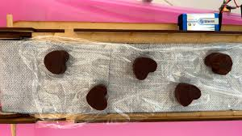
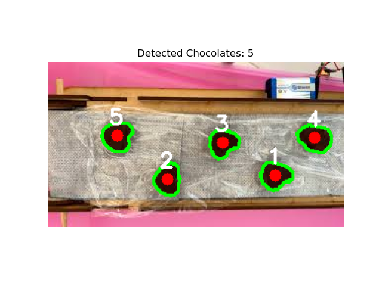

# Lab 06 — Counting Chocolates with Computer Vision

## Objective
Automatically count how many chocolates are in a photo using OpenCV and Python.


## Strategy
The chocolates are dark brown on a light background. Instead of using grayscale thresholding, I used **HSV color detection** to isolate brown pixels specifically, then filtered blobs by area and shape to remove false positives like the wooden frame.


## Step 1 — Load the Image
```python
img = cv2.imread('img_3.jpg')
img_rgb = cv2.cvtColor(img, cv2.COLOR_BGR2RGB)
hsv = cv2.cvtColor(img, cv2.COLOR_BGR2HSV)
```
Loads the image and converts it to RGB (for display) and HSV (for color detection).



---

## Step 2 — Isolate Brown Pixels
```python
mask = cv2.inRange(hsv, np.array([0, 50, 20]), np.array([20, 255, 100]))
```
Creates a black and white mask — white where brown pixels are detected, black everywhere else. This isolates the chocolates from the background.

---

## Step 3 — Find Blobs
```python
contours, _ = cv2.findContours(mask, cv2.RETR_EXTERNAL, cv2.CHAIN_APPROX_SIMPLE)
```
Traces outlines around every white blob in the mask.

---

## Step 4 — Filter to Only Chocolates
```python
def is_chocolate(cnt):
    area = cv2.contourArea(cnt)
    if not (500 <= area <= 6000): return False
    x, y, w, h = cv2.boundingRect(cnt)
    return min(w, h) / max(w, h) > 0.4

chocolates = [cnt for cnt in contours if is_chocolate(cnt)]
```
Each blob is checked against two rules:
- **Area** must be between 500 and 6000 pixels — rejects noise and large objects like the wood frame
- **Aspect ratio** must be above 0.4 — rejects long thin shapes like the wooden edges, keeps squarish chocolates

---

## Step 5 — Draw and Display Results
```python
for i, cnt in enumerate(chocolates):
    M = cv2.moments(cnt)
    cx, cy = int(M["m10"]/M["m00"]), int(M["m01"]/M["m00"])
    cv2.drawContours(output, [cnt], -1, (0,255,0), 2)
    cv2.circle(output, (cx,cy), 6, (255,0,0), -1)
    cv2.putText(output, str(i+1), (cx-8, cy-12), cv2.FONT_HERSHEY_SIMPLEX, 0.7, (255,255,255), 2)
```
For each detected chocolate:
- Green outline drawn around it
- Red dot placed at the center
- Number label written above the center



---

## Result
**5 chocolates detected** ✓

---

## Full Code
```python
import cv2
import numpy as np
import matplotlib.pyplot as plt

img = cv2.imread('img_3.jpg')
img_rgb = cv2.cvtColor(img, cv2.COLOR_BGR2RGB)
hsv = cv2.cvtColor(img, cv2.COLOR_BGR2HSV)

mask = cv2.inRange(hsv, np.array([0, 50, 20]), np.array([20, 255, 100]))
contours, _ = cv2.findContours(mask, cv2.RETR_EXTERNAL, cv2.CHAIN_APPROX_SIMPLE)

def is_chocolate(cnt):
    area = cv2.contourArea(cnt)
    if not (500 <= area <= 6000): return False
    x, y, w, h = cv2.boundingRect(cnt)
    return min(w, h) / max(w, h) > 0.4

chocolates = [cnt for cnt in contours if is_chocolate(cnt)]
output = img_rgb.copy()
for i, cnt in enumerate(chocolates):
    M = cv2.moments(cnt)
    cx, cy = int(M["m10"]/M["m00"]), int(M["m01"]/M["m00"])
    cv2.drawContours(output, [cnt], -1, (0,255,0), 2)
    cv2.circle(output, (cx,cy), 6, (255,0,0), -1)
    cv2.putText(output, str(i+1), (cx-8, cy-12), cv2.FONT_HERSHEY_SIMPLEX, 0.7, (255,255,255), 2)

plt.imshow(output)
plt.title(f'Detected Chocolates: {len(chocolates)}')
plt.axis('off')
plt.show()

print(f'Total chocolates detected: {len(chocolates)}')
```
